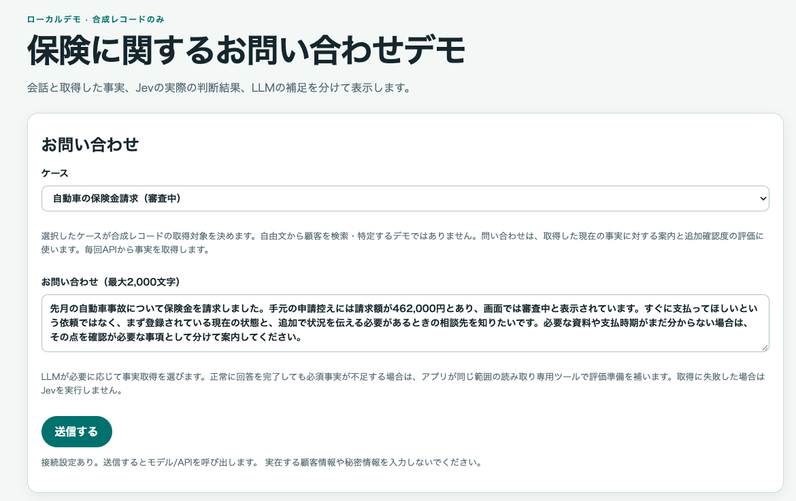
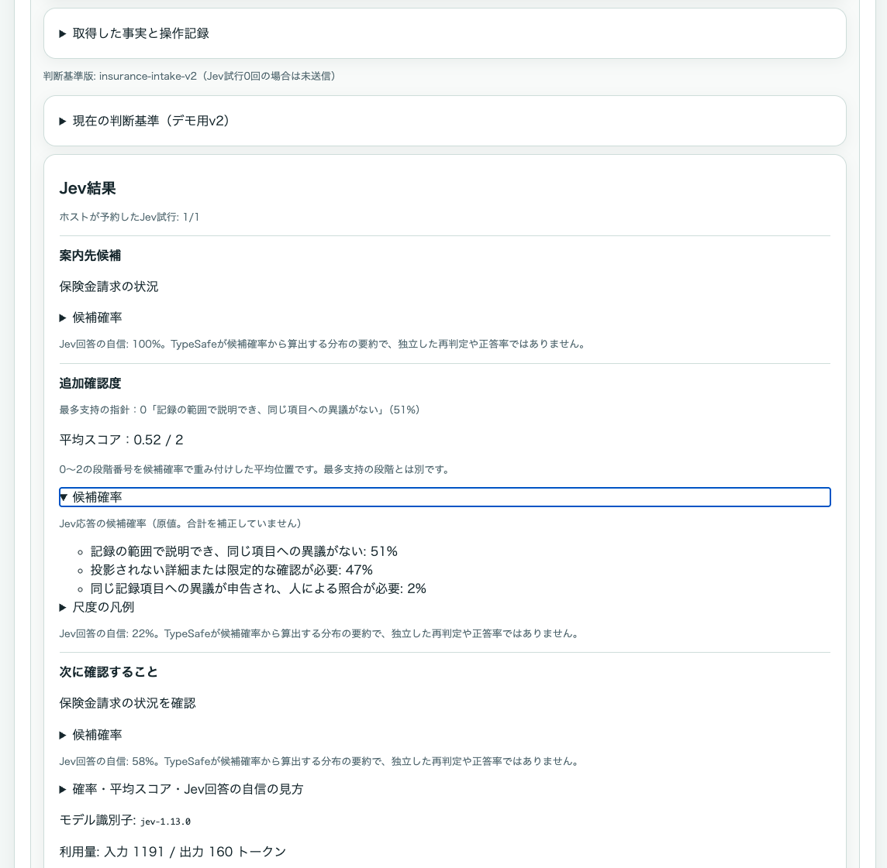
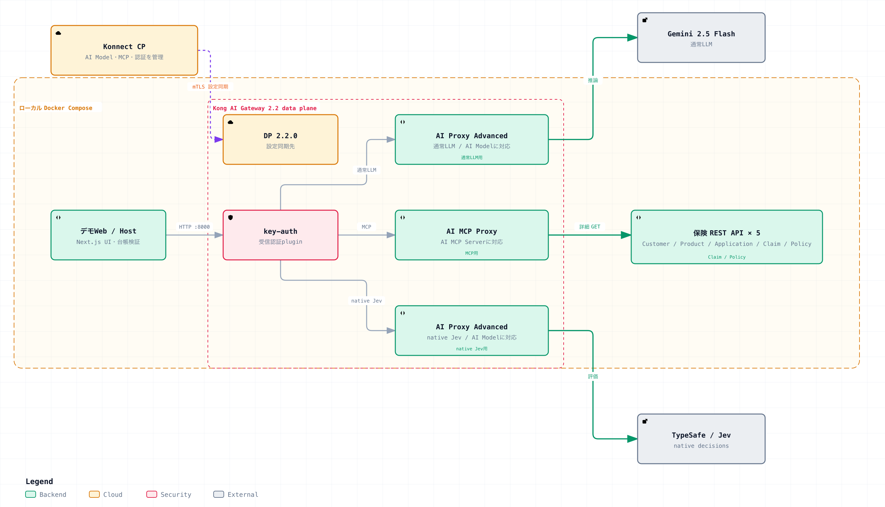

# Kong AI Gateway 2.2 × Jev — 保険問い合わせデモ

10件の合成ケースで、問い合わせ内容と保険記録を照らし合わせる会話デモです。通常のLLMがKong AI Gateway経由で読み取り専用MCPツールを選び、ホストが取得事実を検証してTypeSafeのJevへ渡します。画面では、記録、Jevの判断、別のLLM補足を分けて確認できます。

このUIは日本語のライブ実行用です。オフラインfixtureは内部テストだけに使います。実在する顧客情報や秘密を入力しないでください。

## 画面例

*入力画面の例です。実際の接続状態やモデルの回答品質を証明する画像ではありません。*

*結果画面の例です。画面表示は実験証拠や保険上の判断ではありません。*

## 何が起きるか

*通常LLMはMCPツールを選び、ホストは当ターンの事実を検証してからJevを呼びます。Jevの後のLLM補足は別表示です。*

図の元データと参照根拠は[アーキテクチャ資料](resources/architecture/README.md)を参照してください。

1. **問い合わせ**: 利用者が合成ケースを選び、問い合わせを入力します。問い合わせ文から顧客を検索することはありません。
2. **通常LLM**: 通常LLMはKong AI Gateway 2.2を通り、許可されたMCPの詳細取得ツールを選びます。正常に応答した後に必須事実が足りない場合だけ、ホストが不足分を取得することがあります。LLMが失敗した場合、ホストは補完せず評価を止めます。
3. **MCP保険API**: Customer、Product、Application、Claim、Policyの5種類から、許可されたGET詳細操作だけを使います。サーバーは生のAPI応答を投影し、許可された項目だけをLLM SDKへ返します。
4. **ホスト台帳とJev**: ホストは今回のターンで取得した型・ID・参照関係を検証します。必要な事実が揃ったターンだけ、現在の問い合わせとIDを除いた投影事実をTypeSafeのネイティブ形式でJevへ送り、3項目を評価します。JevはLLMのツールではありません。
5. **LLM補足**: Jevの結果が有効な場合、通常LLMがツールを使わずに補足を生成することがあります。補足はJevの結果を書き換えません。

## 画面で確認するもの

- 利用者の申告と、当ターンに取得した保険記録
- 取得元、許可された参照関係、LLMまたはホストが行った取得操作
- 判断基準の版と3項目の定義
- Jevが返した受付候補、追加確認度、次に確認すること、各確率と自信
- Jevとは別に表示するLLM補足

v2の「追加確認度」は0〜2の連続した平均スコアです。最多支持の段階、平均スコア、Jevが返した「Jev回答の自信」は別の値です。詳細と各表示の読み方は[Chat UIガイド](Chat%20UI.md)を参照してください。

## このデモで行わないこと

- 保険引受、補償範囲の確定、支払可否、本人確認、契約有効性の判定
- リスト検索、Simulation、書き込み、実際の担当部署への割当
- 実在する個人情報、実際の健康情報、口座情報、認証情報の送信
- 失敗したJev呼び出しを成功結果へ置き換えること

「支払済」は銀行口座への入金を確認した意味ではありません。請求額と支払記録額の差だけで不足払いと判断せず、未記録の`null`を0へ変換しません。申告上の差は、記録の誤りや真の矛盾が確認されたことを意味しません。

## 実行状態と制約

現在の受入構成では、Kong AI Gateway 2.2で管理する通常AI ModelにGemini 2.5 Flash、別のJev用AI ModelにTypeSafeネイティブ`decisions`を使用します。どちらも公式mappingではAI Proxy Advancedに対応します。この構成の受入は、個別リクエストのwire trace、全10ケースの動作、回答品質を証明するものではありません。過去のS1ライブ記録はv1基準の履歴として[Compose実行記録](docs/ai-gateway-compose.md)に残っています。現行のv2基準や追加確認度をその実行結果で評価し直さないでください。

ライブ送信はモデル、MCP、Jevへの実通信と費用が発生し得ます。設定が`ready`でも、上流の疎通や判断品質を確認したことにはなりません。合成データで使用し、送信前に利用するAPIの費用と認証設定を確認してください。起動手順は[INSTRUCTIONS.md](INSTRUCTIONS.md)、ケースごとの入力と期待方向は[TEST.md](TEST.md)を参照してください。

リアルタイムストリーミングとメッセージ部品ごとの描画は未実装です。プロセス再起動後や複数インスタンス間の会話・再送保証もありません。呼び出し回数のUI quotaや金額上限はありません。

## 読む順番

1. [INSTRUCTIONS.md](INSTRUCTIONS.md): Terraform・kongctlによる構築とCompose起動手順
2. [Chat UI.md](Chat%20UI.md): 操作、ターン、証拠、スコアと確率の見方
3. [TEST.md](TEST.md): 10ケースの入力全文、期待方向、比較手順
4. [設計方針](docs/design-brief.md)と[検証計画](docs/test-plan.md): 現行仕様と検証範囲
5. [ADR 0003](docs/decisions/0003-reproducible-setup-and-app-layout.md): IaC・公開イメージ・配置の判断
6. [ADR 0001](docs/decisions/0001-agent-and-host-decision-boundary.md)と[ADR 0002](docs/decisions/0002-fresh-turns-and-contextual-intake-v2.md): 設計判断

作業履歴は[トラブルシューティング記録](docs/troubleshooting-log.md)、過去の画面検証は[ブラウザー証拠](docs/evidence/browser-smoke.md)、作業項目のローカル記録は[Issue #1の記録](docs/issue-draft.md)を参照してください。

## リポジトリの構成

| 場所 | 責務 |
| --- | --- |
| `app/` | UI・APIホストのソース、テスト、npm/Next.js/TypeScriptの設定。UIはここからビルドします。 |
| `config/` | KonnectとAI Gatewayの構築設定。秘密やstateはGit管理外です。 |
| `docker/` | UIのコンテナ定義。保険APIは公開GHCRイメージを取得し、独自ビルドしません。 |
| `docs/` / `resources/` | 仕様、検証記録、図、画面例 |
| `scripts/` | アプリと独立したKonnect診断・検証用Pythonツール |

構築は公式安定版Terraform provider `kong/konnect` 3.25.0とkongctl 1.20.2を使います。

ルートにはComposeと環境設定のひな形を残し、全体を起動する入口を揃えています。`.github/workflows/`はGitHub Actionsの検出位置です。Next.js/npmの標準配置は`app/`の中で維持しています。
