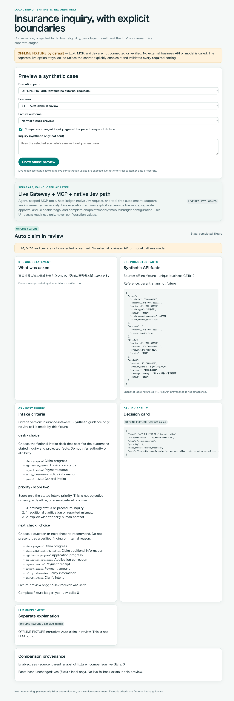
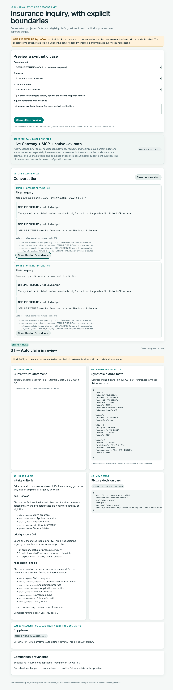
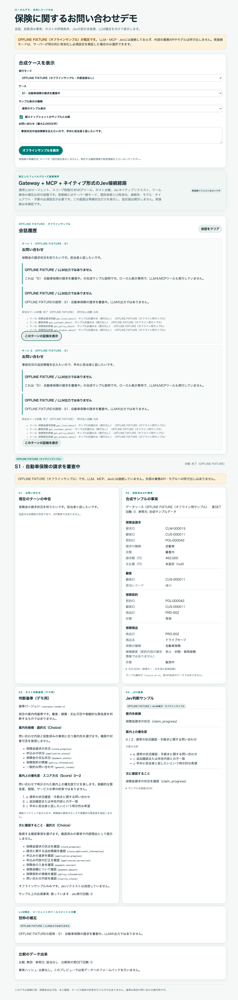
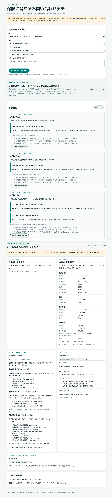

# オフラインブラウザーsmokeの履歴

> この記録は2026-10-05の過去版を、オフラインfixtureで確認した証拠です。現在のライブ専用UI、10ケース、`insurance-intake-v2`のライブ検証ではありません。fixtureの画面画像は変更していません。

## 実行条件

production buildをlocalhostで、既定のオフライン設定のまま提供しました。live設定や認証情報は渡していません。

## 当時の確認結果

- S1、S2、S3のfixture previewで、当時承認された合成ID、nullable項目、fixture表示を確認しました。
- 各ケースのfixture比較で、`parent_snapshot fixture`、live GET 0件、fixture専用facts hash表示を確認しました。この比較画面は現在の機能ではありません。
- 事実不足fixtureは`unassessed`、Jev呼出し0回、過去の成功カードなしでした。
- Jev失敗fixtureは`decision_error`、過去の判断カードなし、補足をskipしました。
- 補足失敗fixtureでは判断カードを残し、補足失敗を別表示しました。
- 入力、投影事実、版付き基準、順序付きpriority尺度、Jevカードが分離され、補足に専用ラベルがありました。
- live readinessは既定でlockedで、設定値を表示しませんでした。ブラウザー通信はlocalhostのreadinessとoffline endpointだけでした。

Playwrightのブラウザー操作と描画DOMを確認しました。faviconの404が1件ありましたが、機能に関するconsole errorは観測されませんでした。

## 以前の会話UI確認

bounded chat変更後のproduction buildを再度確認しました。

- S1の問い合わせを続けて2回送ると、結果カードを置き換えず、利用者とassistantの2ターンを追加しました。
- 最初のターンを選ぶと、その問い合わせ、投影事実、基準、判断カード、補足だけを表示し、ターン同士を混ぜませんでした。
- S1からS2へケースを変えると会話、選択中の証拠、pending snapshot、問い合わせ、比較状態が消え、S1のIDと前の問い合わせは残りませんでした。
- localhost requestを遅延させた確認では、処理中にmode、case、clear操作を無効にし、完了時に両ターンを保持しました。
- tool receiptは安全な名前、状態、取得元、件数だけでした。offline計画は未実行と明示し、実tool呼出しは0件でした。
- live readinessはlockedのまま、外部サービスは呼び出しませんでした。

独立コードreviewとmock testでは、同一targetでLLMに渡す前ターン1件と今回の入力の境界、mode reset、Jev事実取得で履歴を除外する動作を確認しました。外部連携の成功を示す記録ではありません。リアルタイムstreamingと永続chat保存は未実装です。

## 以前の日本語UI確認

live設定なしでproduction buildをlocalhostへ提供しました。document languageは`ja`で、title、表示項目、accessibility name、ケース名、fixture会話、証拠summary、失敗メッセージが日本語でした。ID、API名、technical acronym、元のJSONは技術証跡として英語のままです。

- 当時のS1、S2、S3のbase／comparison表示で日本語案内先・next-checkラベルと元のpriority値を保持し、承認済fixtureに未対応値fallbackはありませんでした。比較fixtureの親snapshot、変更なしのfixture hash、live GET 0件も表示しました。
- 事実不足は日本語の未評価状態、Jev 0回、判断カードなしでした。Jev失敗は代替カードなし、補足失敗は判断カードを残した別表示でした。
- 2件の日本語問い合わせを別ターンとして追加し、1件目を選ぶと対応する問い合わせと証拠を復元しました。ケース変更時は会話、証拠、入力、比較状態を消去しました。
- 投影事実と判断のsummaryは日本語の表示mapを使い、原JSONを開くと英語keyと合成IDを保持しました。raw detailsは初期表示で折りたたまれていました。
- offline UI optionはdisabled、readinessはlockedで、browser API通信はlocalhostのreadiness／offline endpointだけでした。外部サービスは呼び出しませんでした。

native decisionのconfidence／確率／連続Scoreと未知値mapは、実サービスではなく合成契約データで確認しました。TypeSafe nativeの質問、指示、rubric wire valueは変更していません。通常LLMと補足promptは日本語応答を求めますが、ライブ時の言語動作は未確認でした。この過去確認時点ではstreaming、永続保存、外部連携にも未実装・未確認の限界がありました。

## 現行の実行記録との区別

2026-10-06のv1基準S1ライブ実行とTypeSafe native Jevの単独smokeは、[Compose実行記録](../ai-gateway-compose.md)の別証拠です。上記のoffline browser smokeをlive証拠と混同せず、v1の結果を現行v2に読み替えません。
